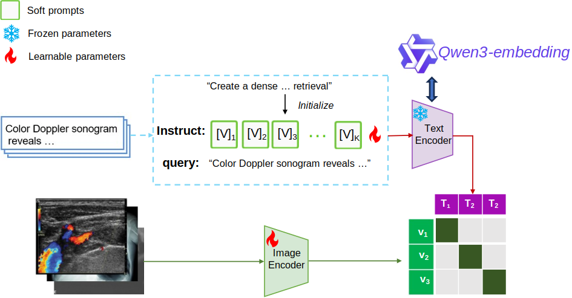

# QwenCLIP
This is the implementation of [ISBI26]:QwenCLIP: Boosting Medical Vision-Language Pretraining via LLM Embeddings and Prompt tuning





### Requirements

Run the following command to install the required packages:

```bash
pip install -r requirements.txt
```

### Preparation
First, Download Qwen-embedding model as shown in the [HuggingFace](https://huggingface.co/Qwen/Qwen3-Embedding-8B).

There are 0.6B, 4B and 8B variants available, we recommend you to use Qwen-embedding 8B if have access to v100/A100-equiviant GPU.


### Training

Now you can start to train the model from pulicly available weights pretrained by [OpenAI](https://openaipublic.azureedge.net/clip/models/5806e77cd80f8b59890b7e101eabd078d9fb84e6937f9e85e4ecb61988df416f/ViT-B-16.pt):

```angular2
python QwenCLIP.py
```


## Acknowledgement

The code is based on [CoOp](https://github.com/KaiyangZhou/CoOp), [CLIP](https://github.com/OpenAI/CLIP).
We thank the authors for their open-sourced code and encourage users to cite their works when applicable.
